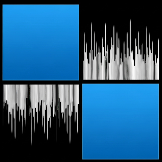

# WinKlang 🎶

[](https://wakatime.com/badge/user/c8cd0c53-219b-4950-8025-0e666e97e8c8/project/eec5a81a-6bee-4a87-ac29-6e43f71f8a1d)

A simple, modern command-line tool for controlling media players on Windows, inspired by `playerctl`.



## About The Project

**WinKlang** is a lightweight, powerful command-line utility for Windows that allows you to control media playback from any application that integrates with the native System Media Transport Controls (SMTC).

Inspired by the simplicity and power of `playerctl` on Linux, WinKlang brings a similar seamless experience to the Windows terminal. Whether you're listening to music on Spotify, watching a video in your browser, or using a desktop media player, WinKlang gives you full control without ever leaving your keyboard.

## Key Features

- **Universal Control:** Manage playback (play, pause, next, previous) for all SMTC-compliant applications (Spotify, Chrome, Edge, etc.).
- **Rich Metadata:** Instantly retrieve the current track's title, artist, album, and playback status.
- **JSON Output:** Get machine-readable output for easy integration with scripts, bars (like Polybar/Waybar on WSL), or other tools.
- **Artwork Support:** Automatically saves and displays information about the current album art.
- **Timeline Info:** View current playback position, total duration, and a visual progress bar.
- **Lightweight:** Built with .NET 9.0 as a single-file executable (~17MB) with no external dependencies.

## Getting Started

### Installation

1. Go to the [**Releases**](../../releases) page.
2. Download the latest `WinKlang.exe` file.
3. Place it in a folder that is included in your system's PATH (e.g., `C:\Windows\System32` or a custom `bin` folder), or run it directly from its location.

### Building from Source

If you prefer to build it yourself:

1. Ensure you have the **.NET 9.0 SDK** installed.

2. Clone the repository:

   ```sh
   git clone https://github.com/codershubinc/WinKlang.git
   ```

3. Navigate to the project directory:

   ```sh
   cd WinKlang
   ```

4. Build the project:

   ```sh
   dotnet publish -c Release -r win-x64 --self-contained
   ```

   The executable will be in `bin/Release/net9.0-windows10.0.17763.0/win-x64/publish/`.

## Usage

Run `WinKlang` from your terminal (PowerShell, CMD, or Git Bash).

### Basic Commands

| Command                 | Description                                                      |
| ----------------------- | ---------------------------------------------------------------- |
| `WinKlang`              | Displays formatted status, metadata, timeline, and artwork info. |
| `WinKlang --json`       | Outputs all media information in JSON format.                    |
| `WinKlang --play-pause` | Toggles play/pause for the active media session.                 |
| `WinKlang --next`       | Skips to the next track.                                         |
| `WinKlang --prev`       | Skips to the previous track.                                     |
| `WinKlang --help`       | Shows the help menu.                                             |

### Examples

**Get current status:**

```sh
WinKlang
```

**Control playback:**

```sh
WinKlang --next
WinKlang --play-pause
```

**Get JSON output:**

```sh
WinKlang --json
```

## Requirements

- Windows 10 (Build 17763 or later) or Windows 11.
- No .NET Runtime installation required (it's self-contained).

## License

Distributed under the MIT License. See `LICENSE` for more information.
